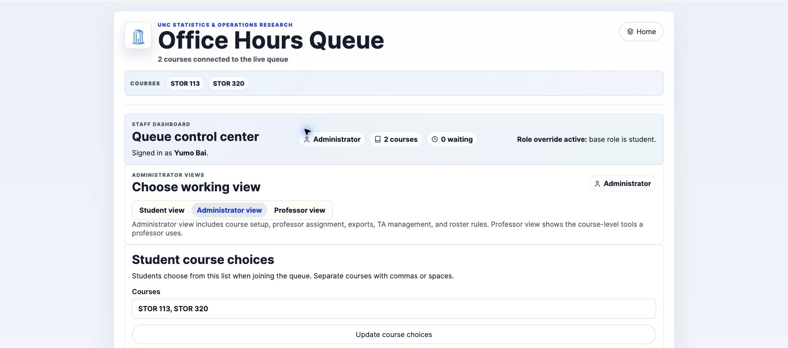
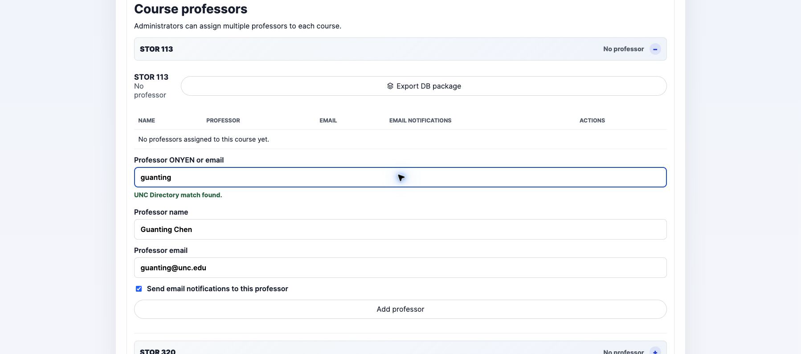
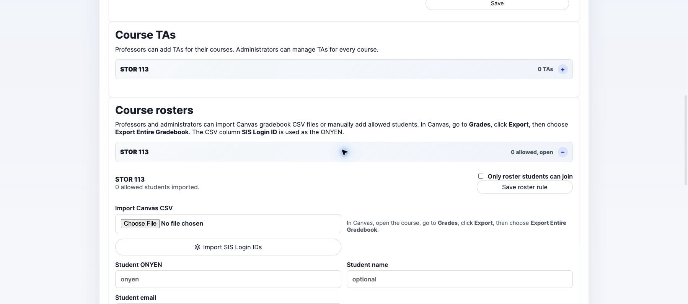
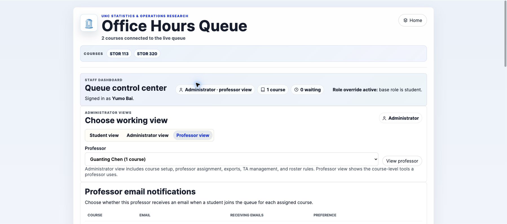
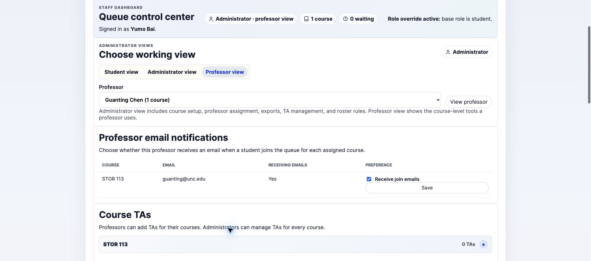
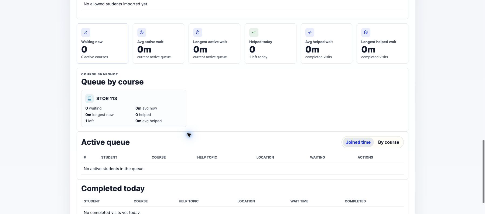

# Office Hours Queue User Guide

This guide is organized by role. Use the section that matches your access level:

- [Administrator Guide](#administrator-guide)
- [Professor Guide](#professor-guide)
- [TA Guide](#ta-guide)

The site is available at:

```text
https://storoh.unc.edu
```

All users sign in with UNC SSO. Access is based on the signed-in user's ONYEN or UNC email address.

## Administrator Guide

Administrators manage the overall course setup. They can create the student course list, assign professors to courses, inspect professor views, manage course rosters, manage TAs for any course, and export course data.

### Administrator Dashboard

After signing in, open the staff dashboard. Administrators see a role view switcher, course setup tools, professor assignment tools, roster controls, TA management, and queue statistics.



### Change the Student Course List

Use **Student course choices** to control which course names students can select when joining the queue.

1. Go to **Student course choices**.
2. Enter course names separated by commas or spaces.
3. Click **Update course choices**.

Examples:

```text
STOR113, STOR320
```

```text
STOR113 STOR320 STOR455
```

If there are many courses, course-specific panels collapse so the dashboard stays manageable.

### Assign Professors to Courses

Use **Course professors** to assign one or more professors to each course.



1. Open the course under **Course professors**.
2. Enter the professor's ONYEN or UNC email address.
3. The app searches UNC Directory.
4. If exactly one directory result is found, **Professor name** and **Professor email** fill automatically.
5. Leave **Send email notifications to this professor** checked if the professor should receive an email when a student joins that course queue.
6. Click **Add professor**.

Professor name and email normally come from UNC Directory. Manual editing requires confirmation. If UNC Directory does not return a unique result, the app warns you so you can check the ONYEN or email before adding the professor.

Each course can have multiple professors. If a professor is removed from a course, they lose access to that course's professor view.

### Use Professor View as an Administrator

Administrators can preview course tools from a professor's perspective.

1. In **Choose working view**, select **Professor view**.
2. Choose a professor from the professor dropdown.
3. Click **View professor**.

This is useful for checking whether a professor has the correct courses, TAs, roster controls, and queue view.

### Manage Rosters

Administrators can control whether each course queue is open to all signed-in UNC users or restricted to an allowed roster.



1. Go to **Course rosters**.
2. Open the course.
3. Check or uncheck **Only roster students can join**.
4. Click **Save roster rule**.

When roster restriction is on, students who are not on the allowed list see a join-failed message and cannot enter that course queue.

### Import Students from Canvas

To import a roster from Canvas:

1. Open the Canvas course.
2. Go to **Grades**.
3. Click **Export**.
4. Choose **Export Entire Gradebook**.
5. In the queue dashboard, open **Course rosters**.
6. Upload the CSV under **Import Canvas CSV**.
7. Click **Import SIS Login IDs**.

The app reads the `SIS Login ID` column as the student's ONYEN.

### Manually Add Allowed Students

Manual entries are useful for late adds, guests, or students missing from Canvas export.

1. Open the course under **Course rosters**.
2. Enter the student's ONYEN.
3. Optionally enter name and email.
4. Click **Add allowed student**.

### Manage TAs for Any Course

Administrators can add or remove TAs under **Course TAs**. This works the same way as the professor workflow described below.

### Export a Course Data Package

Use **Export DB package** to download a JSON snapshot for one course.

The package includes:

- Course name.
- Professor assignments and professor email-notification settings.
- TA assignments and TA email-notification settings.
- Roster restriction setting.
- Allowed student list.
- Queue entries for that course.

Common uses:

- Audit who had access to a course.
- Review queue activity after office hours.
- Share a course-specific data snapshot with another administrator.

## Professor Guide

Professors manage the courses assigned to them by an administrator. A professor can view and manage assigned course queues, configure their own email notifications, add or remove TAs, manage rosters, and review course statistics.

### Professor Dashboard

After signing in, open the staff dashboard. Professors see only their assigned courses.



### Choose Queue Layout

The **Active queue** panel supports two views.

**Joined time** shows all assigned-course students in one first-come-first-served list.

**By course** separates students into course-specific queues. Each course is still sorted by join time.

Use **Joined time** when one team is serving all courses together. Use **By course** when staff are split by course.

### Help a Student

1. Go to **Active queue**.
2. Review the student's name, course, help topic, location, and wait time.
3. Meet the student in person or through the provided UNC Zoom link.
4. Click **Mark helped** when the visit is complete.

The entry moves to **Completed today**.

### Remove a Student

Use **Remove** only when the student should no longer be active in the queue.

Good examples:

- The student left without clicking **Leave queue**.
- The student joined the wrong queue.
- The request was resolved outside the queue.

Removed entries count as students who left today.

### Manage Professor Email Notifications



1. Go to **Professor email notifications**.
2. For each assigned course, check or uncheck **Receive join emails**.
3. Click **Save**.

This setting controls whether you receive an email when a student joins that course queue. It does not affect TA email settings.

### Add TAs to Your Courses

Use **Course TAs** to assign TAs to your courses.

1. Open the course under **Course TAs**.
2. Enter the TA's ONYEN or UNC email address.
3. Enter the TA email address if needed. If left blank, the app uses `<onyen>@unc.edu`.
4. Decide whether this TA should receive queue-join emails for that course.
5. Click **Add TA**.

A TA can be assigned to multiple courses.

### Remove TAs

1. Go to **Course TAs**.
2. Find the TA under the correct course.
3. Click **Remove**.

Removing a TA removes their access to that course's staff queue view.

### Manage Course Rosters

Professors can manage roster restrictions for assigned courses.

1. Go to **Course rosters**.
2. Open the course.
3. Turn **Only roster students can join** on or off.
4. Import a Canvas CSV or manually add students as needed.

When restriction is enabled, only allowed students can join that course's queue.

### Review Queue Statistics

The dashboard includes live and daily statistics.

Top summary cards show:

- Waiting now.
- Average active wait.
- Longest active wait.
- Helped today.
- Average helped wait.
- Longest helped wait.

Course snapshot cards show the same information per course.

## TA Guide

TAs can view and manage only the courses assigned to them. They can help students, remove abandoned entries, choose queue layout, and decide whether to receive email notifications for their assigned courses.

### TA Dashboard

After signing in, open the staff dashboard. TAs see only assigned courses.



If you cannot access the dashboard, ask the professor or administrator to check that your ONYEN or email was added under the correct course.

### Choose Queue Layout

Use **Joined time** for one shared first-come-first-served queue.

Use **By course** when different TAs are helping different courses.

### Help a Student

1. Find the student in **Active queue**.
2. Check the course, help topic, location, and wait time.
3. Help the student.
4. Click **Mark helped**.

### Remove a Student

Use **Remove** when a student should leave the active queue without being marked helped.

Examples:

- The student is no longer present.
- The student joined the wrong course queue.
- The student no longer needs help.

### Manage TA Email Notifications

1. Go to **TA email notifications**.
2. For each assigned course, check or uncheck **Receive join emails**.
3. Click **Save**.

This setting is course-specific. You can receive emails for one assigned course and turn them off for another.

### What TAs Cannot Do

TAs cannot assign professors, export course DB packages, or manage courses they are not assigned to.

## Student-Facing Notes

Students can:

- Select a course from the dropdown.
- Describe what they need help with.
- Enter **In person** or a valid UNC Zoom link.
- See their own queue position and wait time.
- Leave the queue before being helped.

Students cannot see the full queue or other students' names.

## Recommended Operating Procedure

Before office hours:

1. Confirm course names are correct.
2. Confirm professors and TAs are assigned to the right courses.
3. Confirm roster restrictions are correct.
4. Confirm email notification settings.

During office hours:

1. Keep the staff dashboard open.
2. Use **Joined time** or **By course** based on staffing.
3. Mark students helped as soon as each visit is complete.
4. Remove abandoned or mistaken entries.

After office hours:

1. Review **Completed today**.
2. Review wait-time statistics.
3. Adjust staffing or course setup if wait times are high.

## Troubleshooting

### A professor cannot access a course

Ask an administrator to confirm the professor is assigned under **Course professors** for that course.

### A TA cannot access the dashboard

Ask a professor or administrator to confirm the TA is assigned under **Course TAs** with the correct ONYEN or email.

### A student cannot join a restricted course

Check **Course rosters** and confirm the student's ONYEN appears in the allowed-student list. For Canvas imports, confirm the CSV came from **Grades > Export > Export Entire Gradebook** and includes `SIS Login ID`.

### A staff member is not receiving email

Check:

- Their professor or TA email address is correct.
- Their course-specific email checkbox is enabled.
- The student joined the course assigned to that professor or TA.
- Email notifications are enabled in the app's deployment configuration.

### A professor name or email does not auto-fill

The app uses UNC Directory for professor lookup. Confirm the ONYEN or email is correct and that UNC Directory returns exactly one result. If the app cannot find a unique result, it warns the administrator instead of saving a stale name or email.
