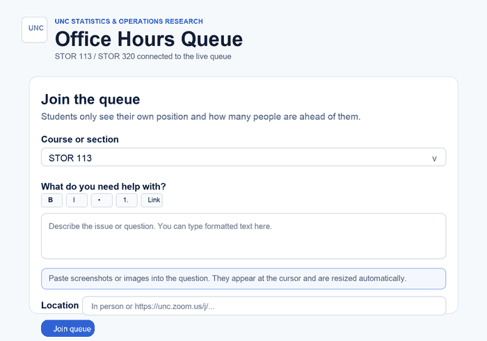
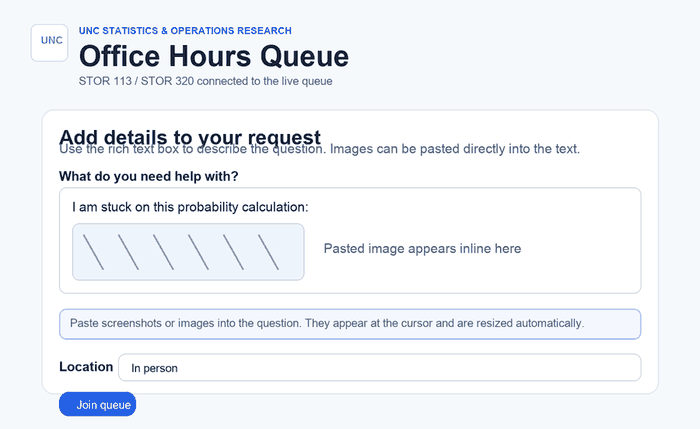
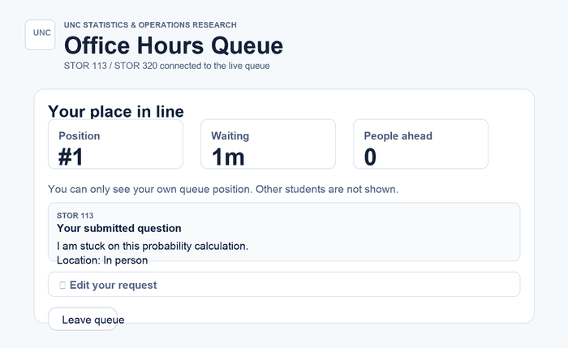

# Office Hours Queue Student Guide

This guide explains how students use the UNC STOR Office Hours Queue.

Site:

```text
https://storoh.unc.edu
```

All students sign in with UNC SSO. The queue uses your UNC identity so staff can see your name and UNC email address.

## Join the Queue

After signing in, open the student page and use **Join the queue**.



1. Choose the correct course or section.
2. Describe what you need help with.
3. Enter your location.
4. Click **Join queue**.

Students can only have one active queue entry at a time.

## Write Your Question

Use the rich text box to describe your question clearly. You can use basic formatting such as bold text, italic text, lists, and links.

Screenshots or images can be pasted directly into the question box. Images appear inside the text where your cursor is placed.



The app automatically resizes pasted images before upload. You can attach up to five images to a queue request.

If you paste an image by mistake, delete the image from the text box before joining the queue.

## Enter Your Location

Use one of these location formats:

```text
In person
```

or a valid UNC Zoom link:

```text
https://unc.zoom.us/j/...
```

Non-UNC Zoom links are not accepted.

## While You Are Waiting

After joining, you see your own queue status.



The status page shows:

- Your position in line.
- How long you have been waiting.
- How many people are ahead of you.
- Your submitted question.
- Your location.

Students cannot see other students or the full staff queue.

## Edit Your Request

If you need to fix your question after joining, use **Edit your request**.

Editing your request does not move you to the back of the line. Your original join time is kept.

You can update:

- Your help topic.
- Formatting.
- Pasted images.
- Location.

## Leave the Queue

Click **Leave queue** if you no longer need help or joined by mistake.

Leaving removes your active queue entry. If you need help again later, join the queue again.

## Restricted Courses

Some courses may be restricted to a roster uploaded by the course staff.

If you try to join a restricted course and are not on the allowed roster, the app shows a join-failed message. Contact your professor or TA if you believe you should have access.

## Email and Privacy

When you join a queue, assigned course staff may receive an email notification. The notification can include:

- Your course.
- Your name.
- Your UNC email address.
- Your location.
- Your submitted question and pasted images.

Only staff assigned to the course can view and manage that course queue.

## Troubleshooting

If you cannot sign in, make sure you are using UNC SSO.

If your course is missing, contact the course staff.

If a Zoom link is rejected, check that it begins with:

```text
https://unc.zoom.us/
```

If an image does not paste correctly, try copying the image again or use a smaller screenshot.
